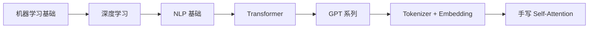

# 第 2 周 Day 7 学习总结：综合复习 + 手写注意力机制

> **核心目标：巩固第 2 周所有知识，动手实现 Self-Attention 核心计算。**

---

## 1. 第 2 周综合复习

### 知识图谱回顾



### 核心知识串联

| Day | 主题 | 核心一句话 |
|-----|------|-----------|
| Day1 | ML 基础 | 监督/无监督/强化三大范式，过拟合是核心挑战 |
| Day2 | 深度学习 | 前向传播算输出，反向传播算梯度，梯度下降更新参数 |
| Day3 | NLP 基础 | Word2Vec 让词变向量，Attention 让模型学会"关注" |
| Day4 | Transformer | Self-Attention + Multi-Head + 位置编码 = 革命性架构 |
| Day5 | GPT 系列 | GPT-1 微调 → GPT-2 Zero-Shot → GPT-3 Few-Shot |
| Day6 | Tokenizer | BPE 子词分词 + Embedding 语义向量 |
| Day7 | 手写实现 | 用代码实现 Attention(Q,K,V) = softmax(QK^T/√d_k)V |

---

## 2. 手写 Self-Attention 核心流程

### 公式

```
Attention(Q, K, V) = softmax(Q × K^T / √d_k) × V
```

### 四步分解

```
Step 1: Q = X × W_Q,  K = X × W_K,  V = X × W_V
  → 生成查询、键、值矩阵

Step 2: scores = Q × K^T / √d_k
  → 计算注意力分数，缩放防止数值过大

Step 3: weights = softmax(scores)
  → 归一化成概率分布（每行和=1）

Step 4: output = weights × V
  → 加权求和得到最终输出
```

### 前端类比

```
Q = 搜索关键词
K = 网页标题
V = 网页内容
Q × K^T = 关键词和标题的匹配度
softmax = 排序归一化
× V = 按匹配度加权返回内容
```

---

## 3. 代码实操结果

```python
# 输入：3个词 × 4维 embedding
X = np.random.randn(3, 4)

# Q/K/V 计算
Q = np.dot(X, W_Q)
K = np.dot(X, W_K)
V = np.dot(X, W_V)

# 注意力分数 + softmax + 加权求和
scores = np.dot(Q, K.T) / np.sqrt(d_k)
weights = softmax(scores)
output = weights @ V
```

**运行结果**：
```
注意力权重：
词1 → 重点关注词2（87.4%）
词2 → 均匀关注三个词
词3 → 重点关注自己（91.2%）

每行之和 = [1, 1, 1] ✅ softmax 正确
```

---

## 4. 面试考点总结

### 必背公式
- `Attention(Q,K,V) = softmax(QK^T/√d_k)V`

### 高频问答
- **为什么除以 √d_k？** → 防止点积过大导致 softmax 梯度消失
- **softmax 数值稳定性？** → 先减去最大值 `exp(x - max(x))` 防溢出
- **Q/K/V 怎么来的？** → 输入 X 分别乘以三个可训练权重矩阵

---

## 5. 避坑指南

1. **变量命名大小写**：`K.T` 不是 `k.T`，Python 区分大小写
2. **softmax 要按行做**：`axis=1, keepdims=True`
3. **矩阵维度要对齐**：Q(3×4) × K^T(4×3) = scores(3×3)

---

## 6. 第 2 周完结！🎉

**下一步**：第 3 周 —— LLM API 与 Prompt Engineering

预习方向：
1. OpenAI API 的核心参数（temperature, top_p）
2. Prompt Engineering 系统化方法（Zero/Few-shot, CoT, ToT）
3. System Prompt 设计模式
